*Reference document for STAMPS@CMU workshop collaborators. Companion documents: Stage 1 outline and Stage 2 derivations + literature in `docs/superpowers/specs/`. This document is Stage 3 — figures and experimental results.*

---

## §1 — The problem: shrinkage under data–prior conflict

Modern Bayesian SED-fitting codes such as Prospector [Johnson et al. 2021; Leja et al. 2017] use empirical priors trained on observed galaxy populations to dramatically tighten parameter inference at low photometric signal-to-noise. The most recent variant, *Prospector-β* [Wang et al. 2023], specifies joint empirical priors over mass, redshift, and star-formation history, fit to the bulk of the typical-galaxy population. For the typical galaxy these priors do real work: they reduce posterior width by factors of 2–5 at fixed photometric uncertainty and stabilize fits at low S/N where the likelihood alone is uninformative [Leja et al. 2019a, 2019b; Pacifici et al. 2023].

For *atypical* galaxies — AGN hosts, recently-quenched post-starburst galaxies, recent-burst high-redshift sources [Suess et al. 2022; Narayanan et al. 2024] — the same empirical priors actively fight the photometry. The prior says "this galaxy should look like the population mean"; the data says "this galaxy is unusual." Standard Bayesian inference returns a posterior that is a precision-weighted compromise between these two voices, with the resulting point estimates biased toward the population and credible regions that systematically miss the true parameters. The Bayesian shrinkage that helps every typical galaxy hurts every atypical one. Figure 1.2 illustrates the failure mode in a synthesized 2D parameter space.

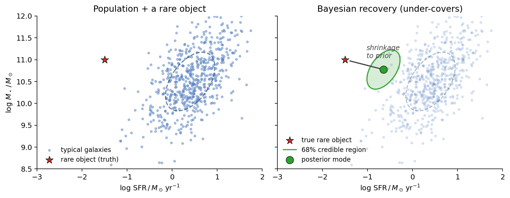{width=92%}

**Figure 1.2.** *Synthesized Prospector-β failure mode for a rare object.* (Left) A typical galaxy population in (log SFR, log M*) parameter space (blue points; dashed contour = 1σ population ellipse), with one rare object (red star) at unusual parameters — e.g., a post-starburst or quenched system. The empirical prior is effectively the density of the typical-galaxy cloud. (Right) The Bayesian recovery (green disk + 68% credible region) is pulled toward the population center, systematically missing the true rare-object parameters. Bayesian inference behaves correctly on average across the population but biases parameter estimates for individual atypical objects — the regime where the science is often most interesting.

This is not a failure of Bayesian inference — the posterior is exactly what the rules of probability dictate, given the prior and likelihood specified. It is a misalignment between the *inferential target* (parameters of a *specific* object) and the *prior's calibration target* (the *population* of objects). For inferring properties of the typical population, the prior is well-calibrated and the posterior is sharp. For inferring properties of individual atypical objects, the prior is miscalibrated *for that object*, and the posterior is systematically biased.

The general phenomenon — *prior–data conflict* — has been recognized since Box [1980] and has a rich diagnostic literature [Evans & Moshonov 2006; Presanis et al. 2013; Marshall & Spiegelhalter 2007]. Figure 1.1 shows the canonical illustration on a 1D Normal–Normal sandbox: a prior centered at μ₀ and a likelihood centered at D ≠ μ₀ produce a posterior centered between the two, neither matching the prior's expectation nor the likelihood's evidence. From a frequentist coverage perspective, the Bayesian point estimate is biased toward μ₀ and the credible region undercovers the true parameter when conflict is strong.

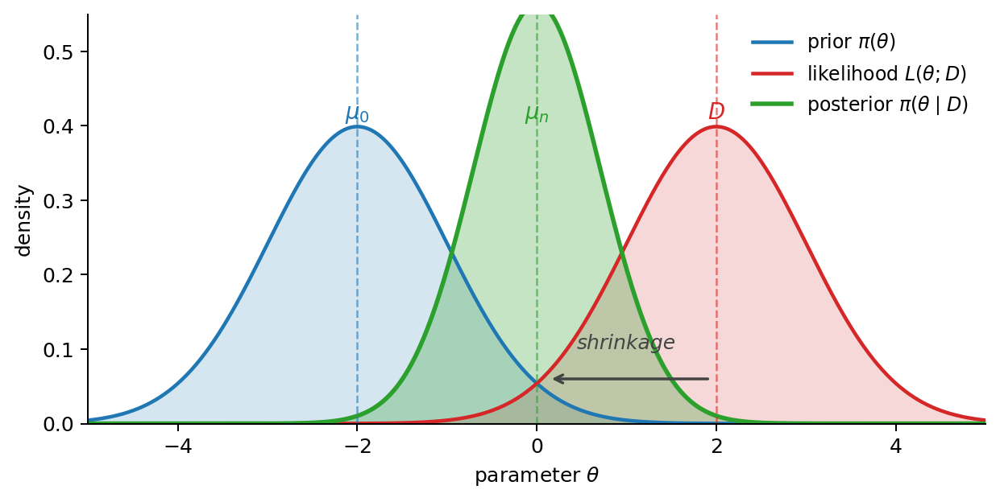{width=82%}

**Figure 1.1.** *Bayesian shrinkage under prior–data conflict on the 1D Normal–Normal sandbox.* Prior $N(\mu_0 = -2, \sigma_0^2 = 1)$ (blue), likelihood $N(D = 2, \sigma^2 = 1)$ (red), and posterior $N(\mu_n, \sigma_n^2)$ (green) with data weight $w = \sigma_0^2 / (\sigma^2 + \sigma_0^2) = 0.5$. The posterior is a precision-weighted compromise: $\mu_n = w D + (1-w)\mu_0 = 0$, $\sigma_n = \sqrt{w}\,\sigma \approx 0.707$. The shrinkage arrow marks the geometric move that biases the Bayesian point estimate away from the data toward the prior. The framework's *scaled prior–data conflict* coordinate $\Delta = (1-w)(\mu_0 - D)/\sigma = -2$ measures this discrepancy in standardized units.

What inferential mode handles this regime correctly? The standard Bayesian response is to robustify the prior — power priors [Ibrahim & Chen 2000], heavy-tailed priors, mixture priors, or robust-Bayes ε-contamination classes [Berger 1990] — but each requires committing to a *new* prior model that is itself subject to misspecification under stronger conflict. The standard frequentist response is to abandon the prior entirely (use Wald-type confidence intervals from the likelihood alone), but this throws away genuinely useful population information for the typical galaxies that make up the bulk of any sample. Neither extreme is the right tool: the typical-galaxy regime needs the prior, the atypical-galaxy regime needs to ignore it, and the data alone does not announce which regime applies.

This paper develops a third path: *adaptive Frasian inference*. The construction is frequentist by design — test inversion (in the sense of Neyman 1937) with explicit coverage guarantees at every parameter value — but the test statistic itself *uses* the prior in a tunable way. Two well-known fixed points exist in the literature: Wald-type inference (no prior in the test) and WALDO-type inference (the prior fully baked into the test via a posterior-residual statistic) [Masserano et al. 2023]. We construct a continuous one-parameter family of prior-aware tests between these endpoints, parameterized by η ∈ [0, 1], and develop the machinery to choose η adaptively. The technical core of the contribution is:

1. **Selecting η from the data D breaks coverage** — a classical post-selection failure of the kind characterized by Berk et al. [2013] and Fithian, Sun & Taylor [2014];
2. **The escape is dynamic tilting**: let η depend on θ rather than D, producing an *adaptive confidence distribution* (in the sense of Schweder & Hjort 2016) that is calibrated by construction;
3. **The η-family is a geometric design choice** with four canonical options (e-, m-, Fisher–Rao, and W₂ geodesics) producing measurably different smoothness profiles in the resulting CIs;
4. **The function η(θ) can be learned** from offline simulation using a dual-head neural-network construction that is empirically both calibrated and narrower than Wald in the conflict band.

The paper is organized as follows. **§2** defines Frasian inference precisely — test inversion with a posterior-based statistic — and shows that the natural read-out is a confidence distribution. **§3** diagnoses the cost: even calibrated Frasian inference pays for conflict, but in width rather than coverage. **§4** introduces the η-tilting family, the post-selection failure of naive η-from-data, and the dynamic-tilting escape. **§5** surveys the four canonical geometric realizations of the η-family. **§6** develops the cross-θ optimization objective and the dual-head learned selector. **§7** presents experimental results on the Normal–Normal sandbox auditing the (geometry × selector × statistic) cross-product. **§8** discusses generalization beyond the sandbox and open directions. All derivations and full reference details appear in the companion Stage-2 document (`docs/superpowers/specs/2026-05-12-adaptive-frasian-paper-stage2-details.md`).

## §2 — Frasian inference: test inversion with a posterior-based statistic

### Test inversion: from a test statistic to a confidence region

Given a parametric model $\{P_\theta : \theta \in \Theta\}$ and observed data $D$, a *test statistic* $T(\theta; D)$ is a function jointly of the parameter being tested and the data. For each candidate $\theta$, the random variable $T(\theta; D')$ has a known null distribution $F_\theta$ when $D' \sim P_\theta$, and the right-tailed *p-value* is

$$p(\theta; D) = P_\theta\bigl(T(\theta; D') \geq T(\theta; D)\bigr) = 1 - F_\theta\bigl(T(\theta; D)\bigr),$$

interpreted as the probability under $H_0: \text{parameter} = \theta$ of observing a test statistic at least as extreme as the realized one. The level-$\alpha$ *acceptance region* for fixed $\theta$ is $A_\alpha(\theta) = \{D : p(\theta; D) > \alpha\}$. Exchanging the roles of $\theta$ and $D$ — the *Neyman inversion* [Neyman 1937] — yields the level-$(1 - \alpha)$ *confidence region* over $\Theta$:

$$C_\alpha(D) = \{\theta \in \Theta : p(\theta; D) > \alpha\} = \{\theta : D \in A_\alpha(\theta)\}.$$

Figure 2.1 visualizes the inversion: the joint accept set $\{(\theta, D) : T < \mathrm{threshold}\}$ is a region of the $(\theta, D)$ plane; its horizontal slices at fixed $\theta$ are the acceptance regions $A_\alpha(\theta)$, and its vertical slices at fixed $D$ are the confidence regions $C_\alpha(D)$. The two are the same set, viewed in two ways.

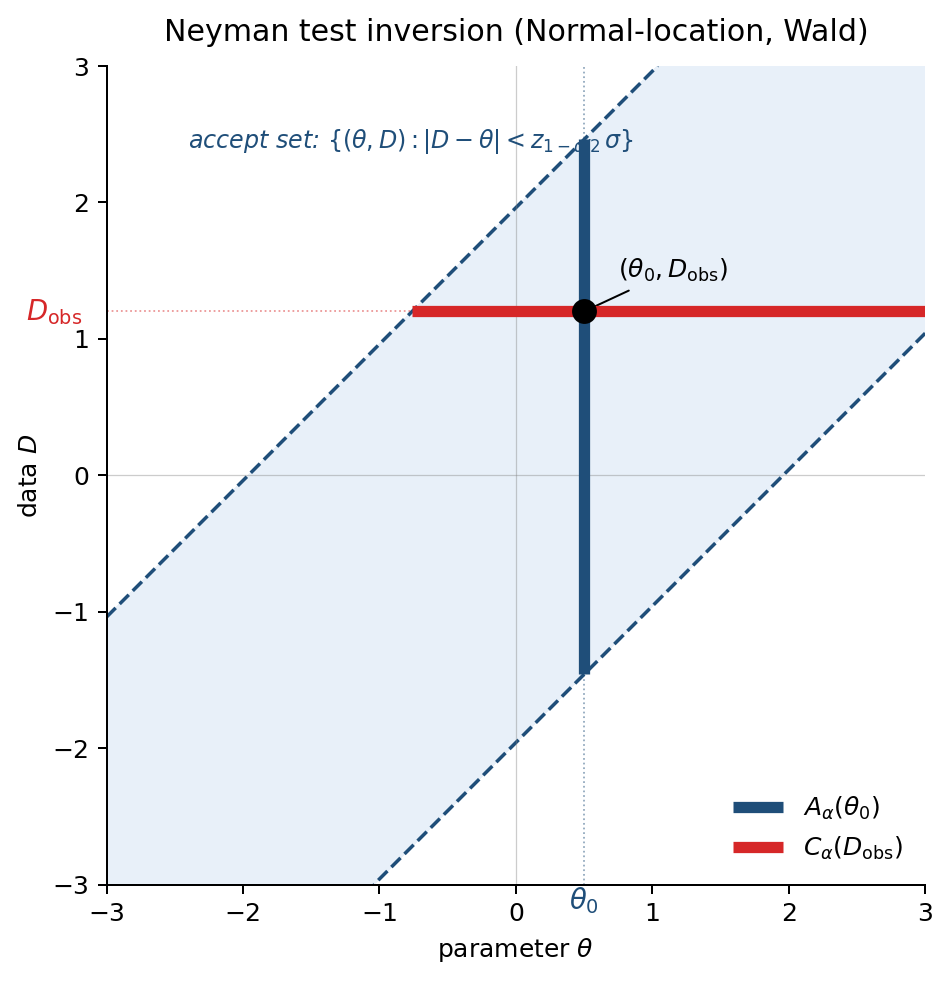{width=70%}

**Figure 2.1.** *Neyman test inversion on the Normal-location sandbox with Wald statistic $T(\theta; D) = (D - \theta)^2/\sigma^2$.* The shaded strip is the joint accept set $\{(\theta, D) : |D - \theta| < z_{1-\alpha/2}\,\sigma\}$. For a fixed parameter value $\theta_0$ (vertical blue dotted line), the acceptance region $A_\alpha(\theta_0)$ is the *vertical* interval in $D$-space (blue bar). For a fixed observed $D_{\rm obs}$ (horizontal red dotted line), the confidence region $C_\alpha(D_{\rm obs})$ is the *horizontal* interval in $\theta$-space (red bar). Coverage holds at every $\theta_0$ by the probability integral transform: $P_{\theta_0}(D \in A_\alpha(\theta_0)) = 1 - \alpha$, hence $P_{\theta_0}(\theta_0 \in C_\alpha(D)) = 1 - \alpha$ — the *frequentist guarantee* with no priors, no asymptotics, no regularity beyond computability of $F_\theta$.

### Wald and WALDO: two endpoints of the prior-information spectrum

The simplest test statistic on the Normal-location sandbox is the *Wald statistic* $T_{\rm Wald}(\theta; D) = (D - \theta)^2 / \sigma^2$, with null distribution $\chi^2_1$ and p-value $2(1 - \Phi(|D - \theta|/\sigma))$. The corresponding confidence region is the textbook Wald interval $C_\alpha(D) = [D - z_{1-\alpha/2}\sigma, D + z_{1-\alpha/2}\sigma]$ [Casella & Berger 2002, Ch. 9]. Wald uses no prior information; the prior cancels because the test statistic does not reference $\mu_0$ or $\sigma_0$ at all.

The same Neyman inversion machinery accepts test statistics that *do* use the prior. The *WALDO statistic* [Masserano et al. 2023] is the squared posterior residual at the tested $\theta$, standardized by the posterior variance:

$$T_{\rm WALDO}(\theta; D) = \frac{(\theta - \mu_{\rm post}(D))^2}{\sigma^2_{\rm post}(D)},$$

with $\mu_{\rm post}(D) = E[\theta \mid D]$ and $\sigma^2_{\rm post}(D) = \text{Var}[\theta \mid D]$ under the (Bayesian) posterior $\pi(\cdot \mid D)$. Structurally, WALDO is the Wald form computed on the *posterior pivot* $(\theta - \mu_{\rm post})/\sigma_{\rm post}$ in place of the *likelihood pivot* $(\theta - \mathrm{MLE})/\sigma_{\rm MLE}$. The prior enters as an *ingredient in the test statistic* — through the posterior moments — not as a Bayesian update of the inference target.

On the conjugate Normal-Normal sandbox, the WALDO null distribution is closed-form. Writing $a(\theta) = |\mu_n - \theta| / (w\,\sigma)$ and $b(\theta) = (1 - w)(\mu_0 - \theta) / (w\,\sigma)$, where $\mu_n = wD + (1-w)\mu_0$ and $w = \sigma_0^2 / (\sigma^2 + \sigma_0^2)$, one obtains

$$p_{\rm WALDO}(\theta; D) = \Phi\bigl(b(\theta) - a(\theta)\bigr) + \Phi\bigl(-a(\theta) - b(\theta)\bigr).$$

Figure 2.2 plots this p-value as a function of $\theta$ for a representative $(\mu_0, \sigma_0, D, \sigma)$. The function peaks at $\theta = \mu_n$ (the WALDO pivot, where $p = 1$) and decays toward zero in both directions; the level-$\alpha$ confidence interval is the set of $\theta$ where $p > \alpha$. On a Monte-Carlo path (no closed form), the same construction is implemented by sampling $D' \sim P_\theta$, recomputing the posterior moments, and forming an empirical tail probability with the $(k+1)/(n_{\rm MC}+1)$ continuity correction [Phipson & Smyth 2010] — preserving conservative coverage at finite sample size.

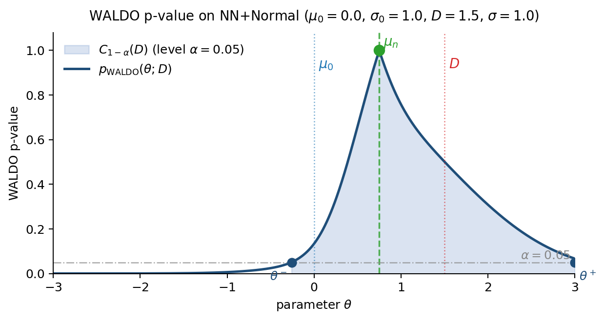{width=82%}

**Figure 2.2.** *WALDO p-value on the Normal-Normal sandbox.* Parameters $(\mu_0, \sigma_0, D, \sigma) = (0, 1, 1.5, 1)$, giving $w = 0.5$, $\mu_n = 0.75$, $\sigma_n \approx 0.707$. The p-value $p_{\rm WALDO}(\theta) = \Phi(b - a) + \Phi(-a - b)$ peaks at $\theta = \mu_n$ (green disk, $p = 1$) and crosses the level-$\alpha$ threshold ($\alpha = 0.05$, gray dash-dot line) at the CI bounds $\theta^\pm$ (blue disks). The resulting confidence interval is asymmetric: it extends further toward $D$ than toward $\mu_0$ because the WALDO pivot $\mu_n$ already sits between the two.

### Confidence distributions: the natural read-out

The p-value function $\theta \mapsto p(\theta; D)$ carries more information than any single confidence interval. Sweeping the inversion across confidence levels and one-sided pivots produces a *confidence distribution* (CD): a function $H(\theta; D)$ on $\Theta \times \mathcal{X}$ such that (i) for each fixed $D$, $\theta \mapsto H(\theta; D)$ is a CDF on $\Theta$, and (ii) for each fixed $\theta_0$, $H(\theta_0; D) \sim U[0, 1]$ under $D \sim P_{\theta_0}$ [Xie & Singh 2013; Schweder & Hjort 2016, Ch. 3]. The uniform-under-truth property is the frequentist calibration; it makes the lower $\alpha$-quantile of $H$ an exact one-sided level-$\alpha$ confidence bound. For the Normal-location case (built from the one-sided right-tail pivot $P_\theta(D' \geq D_{\rm obs})$),

$$H(\theta; D) = \Phi\!\left(\frac{\theta - D}{\sigma}\right),$$

an increasing-in-$\theta$ CDF that is uniformly distributed in $\theta_0$ under $D \sim N(\theta_0, \sigma^2)$. Its density $h(\theta; D) = N(\theta; D, \sigma^2)$ — visually identical to the flat-prior Bayesian posterior. Figure 2.3 shows both the CDF and the density with the canonical $\alpha/2$ tails and CD median marked.

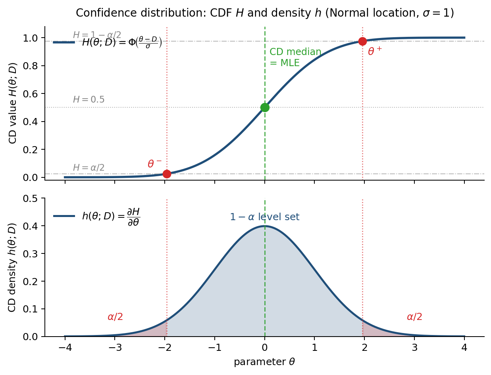{width=82%}

**Figure 2.3.** *Confidence distribution for Normal location, $\sigma = 1$.* (Top) The CDF $H(\theta; D) = \Phi((\theta - D)/\sigma)$, an increasing function in $\theta$ from 0 to 1. The CD median (green disk) coincides with the MLE; the $\alpha/2$ and $1 - \alpha/2$ quantile bounds (red disks) are the one-sided level-$\alpha/2$ confidence bounds. (Bottom) The CD density $h(\theta; D) = \partial H/\partial \theta = N(\theta; D, \sigma^2)$. The $1 - \alpha$ level set (blue band) is the symmetric two-sided confidence interval; the $\alpha/2$ tails (red shading) lie outside.

A CD yields point estimates (the median), level-set confidence regions at any $\alpha$, and integrated functionals (e.g., $\int \theta \, dH$ as a confidence-weighted mean). It is — in Xie & Singh's phrasing — *the frequentist distribution estimator of a parameter*. Multiple CDs from independent data sources can be combined using the *confidence fusion* machinery of Singh, Xie & Strawderman [2005], which extends naturally to priors-as-evidence: a prior treated as a CD from a separate source can be combined with a likelihood-based CD via the same fusion rules, producing a calibrated posterior-like object *without* committing to a Bayesian semantics [Schweder & Hjort 2016, Ch. 4]. The $\eta$-tilting families of §4 will sit inside this picture as one-parameter families of fused CDs.

### CD vs Bayesian posterior: same shape, different semantics

Figure 2.4 places the Normal-location CD next to the (flat-prior) Bayesian posterior on the same axes. The densities are identical — both are $N(D, \sigma^2)$ — yet the two distributions answer different questions. The CD is calibrated by *repeated experimentation*: integrating the CD over a $1 - \alpha$ level set produces an interval whose true-parameter coverage is exactly $1 - \alpha$ under sampling from $P_\theta$. The Bayesian posterior is calibrated by *Bayes' rule*: integrating it over the same level set produces a credible interval whose probability of containing the true parameter is $1 - \alpha$ under the prior. The two notions coincide for flat or weakly informative priors (the *Bernstein–von Mises* phenomenon: under regularity the posterior is asymptotically Gaussian centered at the MLE, and the leading-order agreement with the Wald CD holds for any prior that is positive at $\theta$ [Welch & Peers 1963; Tibshirani 1989; Datta & Mukerjee 2004]) but diverge at $O(n^{-1/2})$ under informative priors — and that divergence is the technical entry point to the prior–data conflict of §3.

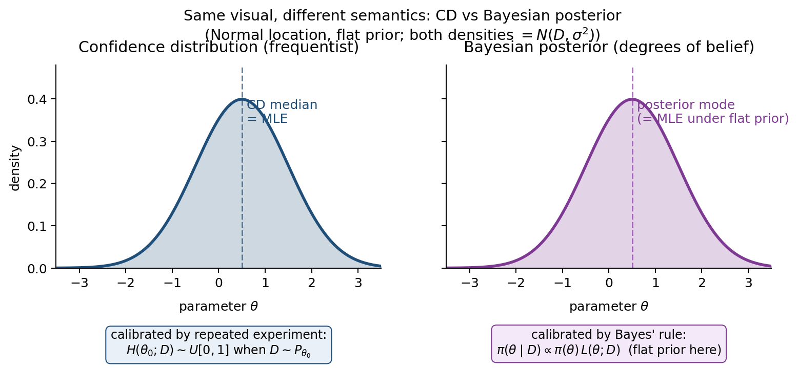{width=92%}

**Figure 2.4.** *Same visual, different semantics.* (Left) The confidence distribution $H(\theta; D)$ is calibrated by repeated experimentation: $H(\theta_0; D) \sim U[0, 1]$ when $D \sim P_{\theta_0}$, so level sets of $H$ are exact frequentist CIs at every $\theta$. (Right) The Bayesian posterior $\pi(\theta \mid D) \propto \pi(\theta)\,L(\theta; D)$ is calibrated by Bayes' rule. Under a flat prior the two densities are identical ($N(D, \sigma^2)$); under informative priors they diverge at $O(n^{-1/2})$, with the divergence growing as conflict grows.

### A note on test-statistic form: WALDO, ScoreO, LRTO

The squared-residual structure of WALDO is one *form* of posterior-based test statistic, parallel to the classical Wald form. Two other forms — the posterior score $T_{\rm ScoreO}(\theta) = U_p(\theta)^2 / I_p(\theta)$ (where $U_p, I_p$ are the score and observed information of the log-posterior) and the posterior likelihood ratio $T_{\rm LRTO}(\theta) = -2[\log \pi(\theta \mid D) - \log \pi(\theta_{\rm MAP} \mid D)]$ — complete a *posterior-based trinity* paralleling the classical (Wald, Score, LRT) trinity. On Gaussian families the three are *exactly equal as functions of $\theta$* (not merely asymptotically equivalent under regularity): substituting $\log q(\theta) = -(\theta - \mu_q)^2/(2\sigma_q^2) + \mathrm{const}$ into each definition yields $(\mu_q - \theta)^2/\sigma_q^2$ in all three cases. For non-Gaussian posteriors (e.g., mixture tilting, §5) the three forms genuinely differ. We use WALDO throughout this paper; the full statement and counterexamples are in the Stage-2 derivation document.

### Lineage: structural inference and the posterior likelihood ratio

The idea of building a frequentist test out of a posterior-based statistic predates the WALDO acronym by half a century. The lineage runs through *structural inference* [Fraser 1968], which framed inference as the joint construction of a model and an error variable bridging fiducial, frequentist, and Bayesian probability; Dempster's *posterior likelihood ratio* [Dempster 1974, 1997], which proposed using the posterior log-density gap as a significance-test statistic and showed it equals the frequentist p-value in the Gaussian case; Aitkin's [1991, 1997] *posterior Bayes factors*, which extended Dempster's PLR to nuisance-parameter settings; and the modern revival under the WALDO and LF2I [Masserano et al. 2023; Dalmasso et al. 2020] frameworks, which operationalize the construction for simulator-based inference. The term *Frasian Inference* itself was coined by Wasserman [2011] in his *Statistical Science* commentary on Fraser's program. From this point of view, the present paper is an "adaptive" entry in this lineage: we let the prior count in the test by a tunable amount, rather than always counting in full (WALDO) or always counting at zero (Wald).

## §3 — The conflict tax inside Frasian inference

§2 established that Frasian/WALDO-style inference is *calibrated by construction* — coverage is guaranteed at every $\theta$ by the Neyman inversion machinery, regardless of how strongly the prior and data disagree. This calibration property is what distinguishes Frasian inference from Bayesian inference under conflict: Bayesian credible intervals are exact for the prior but undercover for the truth when the two disagree (Figure 1.1), while WALDO intervals are exact for the truth at every $\theta$. Figure 3.2 confirms this empirically on the framework's NN sandbox audit: both Wald and WALDO achieve nominal coverage at $\alpha = 0.05$ across the full $\theta_{\rm true}$ grid, with all empirical rates landing within $\pm 2$ percentage points of $0.95$ (MC noise) for every prior strength $w \in \{0.2, 0.5, 0.8\}$.

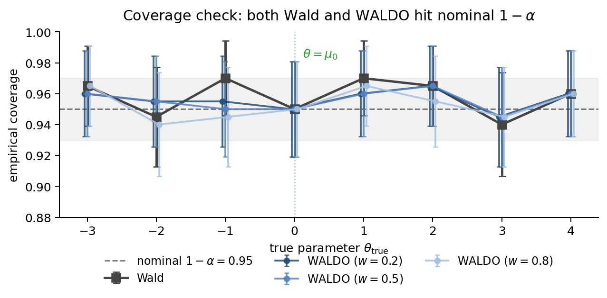{width=82%}

**Figure 3.2.** *Coverage of Wald and WALDO on the Normal-Normal sandbox.* Empirical coverage rates from the framework's `run_wald_audit` cell at $\alpha = 0.05$ over a $(\theta_{\rm true}, w)$ grid; error bars are $\pm 2$ MC standard errors over 200 replications per cell. Both statistics hold to the nominal $1 - \alpha = 0.95$ (dashed line; gray band shows $\pm 0.02$); WALDO does *not* undercover relative to Wald, regardless of prior strength. The conflict-tax effect of §3 is paid entirely in width (Figure 3.1), not in calibration.

So calibration is not the cost of using the prior in the test. But there *is* a cost. Figure 3.1 shows the WALDO CI width on the same sandbox, varying $\theta_{\rm true}$ at fixed prior center $\mu_0 = 0$ — the conflict coordinate is then proportional to $|\theta_{\rm true} - \mu_0|$. Wald's width is flat at $2 z_{1-\alpha/2}\sigma \approx 3.92$ (no prior, no conflict-dependence). WALDO traces a *U-shape*: narrower than Wald near $\theta_{\rm true} = \mu_0$, then inflating as $|\theta_{\rm true} - \mu_0|$ grows, eventually exceeding Wald and continuing to widen.

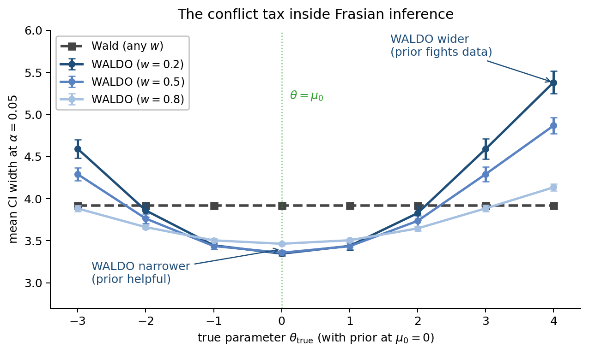{width=86%}

**Figure 3.1.** *The conflict tax inside Frasian inference: WALDO mean CI width as a function of true $\theta$ on the Normal–Normal sandbox.* Wald width (gray dashed) is constant at $2 z_{1-\alpha/2}\sigma \approx 3.92$ — no prior, no conflict-dependence. WALDO traces a U-shape vs $\theta_{\rm true}$ at fixed prior center $\mu_0 = 0$: at low conflict ($\theta_{\rm true} \approx \mu_0$) the prior is informative and helpful, so WALDO is narrower than Wald (by 15–17% at $w = 0.5$); at high conflict ($|\theta_{\rm true} - \mu_0| \gtrsim 3$ with $w = 0.2$) the prior fights the data and WALDO inflates to ~40% wider than Wald. Stronger priors (smaller $w$) carry both larger savings at no-conflict *and* larger penalties at conflict. Error bars are $\pm 2$ MC standard errors over 200 replications per cell.

The mechanism is the one §2 set up: WALDO's pivot is $\mu_n = wD + (1-w)\mu_0$, midway between the data and the prior; under H₀ the test statistic distribution carries a non-centrality $b(\theta) = (1-w)(\mu_0 - \theta)/(w\sigma)$ that grows with the conflict. Coverage is preserved at every $\theta$ by widening the CI to absorb this non-centrality — exactly the inflation seen in Figure 3.1. The *direction* of the trade is opposite to Bayesian inference: Bayesian inference fixes the prior in the posterior and pays for conflict in *bias and undercoverage*; Frasian inference fixes the calibration in the test and pays for conflict in *width*.

The conflict-tax dilemma is then sharp. Neither uniformly dominates the other. The Bayesian regime has tight intervals when prior and data agree but biases and miscalibrates intervals when they disagree. The Frasian (WALDO) regime has correctly calibrated intervals everywhere but inflates them at conflict — precisely the regime where the prior is most informative and we'd most like to use it. Switching from Bayes to Frasian moves the inferential cost from one failure mode to another, not into thin air.

The remainder of the paper develops a way out. The technical observation that unlocks it: WALDO sits at one fixed point of a *one-parameter family* of prior-aware test statistics (§4), the geometry of this family is a design choice with measurable consequences for the resulting CI smoothness (§5), and the optimal choice of "how much prior" can itself be learned from offline simulation (§6) — yielding a calibrated procedure that is *narrower* than both Wald and WALDO at every $\theta$ in the framework's audit (§7).

## §4 — η-tilting, post-selection, and dynamic tilting

### The η-tilting family of test statistics

The conflict-tax dilemma of §3 is sharp because Wald and WALDO sit at opposite extremes — Wald uses no prior, WALDO uses the prior fully. Nothing in the Neyman construction (§2) requires this binary choice. Given any one-parameter family of distributions $\{\pi_\eta(\theta \mid D) : \eta \in [0, 1]\}$ interpolating the posterior $\pi(\theta \mid D)$ (at $\eta = 0$) and the likelihood-as-Gaussian $L(\theta; D)/Z$ (at $\eta = 1$), we can apply a fixed test-statistic form (WALDO-like, Score-like, or LRT-like) to $\pi_\eta$ and obtain a continuous family of prior-aware tests. The framework's canonical choice is the *power-law* family (the e-geodesic of information geometry [Amari & Nagaoka 2000]), with the closed-form

$$\pi_\eta(\theta \mid D) \propto \pi(\theta)^{1-\eta} \cdot L(\theta; D), \qquad \mathrm{denom}(\eta) = 1 - \eta(1 - w),$$

$$\mu_\eta(D) = \frac{w D + (1 - \eta)(1 - w)\mu_0}{\mathrm{denom}(\eta)}, \qquad \sigma_\eta^2(D) = \frac{w\,\sigma^2}{\mathrm{denom}(\eta)}.$$

This is the Theorem-6 closed form derived in the Stage-2 document; at $\eta = 0$ it returns the posterior $(\mu_n, \sigma_n^2)$, at $\eta = 1$ the likelihood-as-Gaussian $(D, \sigma^2)$. Figure 4.1 shows the resulting family at five $\eta$ values on a representative NN+Normal setup.

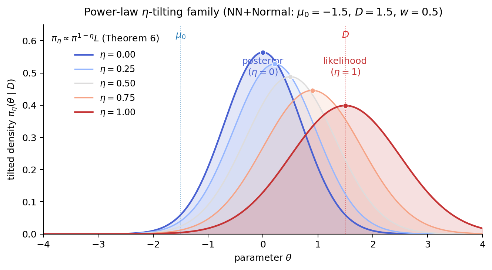{width=86%}

**Figure 4.1.** *Power-law $\eta$-tilting family $\pi_\eta \propto \pi^{1-\eta} L$ on NN+Normal.* Parameters $(\mu_0, D, w) = (-1.5, 1.5, 0.5)$; $\eta$ varies in $\{0, 0.25, 0.5, 0.75, 1\}$ with color gradient from posterior-blue ($\eta = 0$, peak at $\mu_n = 0$) to likelihood-red ($\eta = 1$, peak at $D = 1.5$). The variance grows monotonically as $\eta \to 1$: $\sigma_\eta^2$ goes from $\sigma_n^2 = w\sigma^2 = 0.5$ at $\eta = 0$ to $\sigma^2 = 1$ at $\eta = 1$. The family is geometry-agnostic in concept; §5 surveys three alternative geometric realizations (m-, Fisher–Rao, and W₂ geodesics).

For each $\eta$, the WALDO statistic on the tilted family $T_\eta(\theta; D) = (\mu_\eta(D) - \theta)^2 / \sigma_\eta^2(D)$ has a closed-form p-value of the same $\Phi(b-a) + \Phi(-a-b)$ structure as the WALDO statistic, with $(a, b)$ now functions of $\eta$. Endpoints: $T_0$ is WALDO; $T_1$ is the classical Wald statistic on the likelihood. Intermediate $\eta$ produces a continuum.

### The naive recipe and the post-selection failure

The most natural way to use the family is to *pick the $\eta$ that gives the narrowest CI*: $\hat\eta(D) = \mathrm{argmin}_\eta \mathrm{width}(C_\alpha^\eta(D))$. Then report $C_\alpha^{\hat\eta(D)}$ as the confidence interval. Heuristically this seems unbeatable — at low conflict $\hat\eta \approx 0$ (use the prior, get a tight CI), at high conflict $\hat\eta \approx 1$ (fall back to Wald, get a robust CI). The recipe is invalid: it is a classical post-selection inference [Berk et al. 2013; Fithian, Sun & Taylor 2014] failure mode. The realized null distribution of the *selected* test $T_{\hat\eta(D)}(\theta; D)$ is no longer the null distribution of the *fixed* test $T_{\eta_0}(\theta; D)$ — and using the latter's threshold to invert the former breaks calibration.

Figure 4.2 confirms the failure on the framework's audit. The framework's `NumericalEtaSelector` cell implements exactly the naive recipe; empirical coverage at $\alpha = 0.05$ drops to $\sim 0.92$–$0.94$ across $\theta_{\rm true}$, consistently 2–3 percentage points below the nominal $0.95$, while the identity (fixed-$\eta$) baseline hits $0.95$ exactly. The recipe is a *calibrated negative result* baked into the framework: a measured demonstration that data-driven $\eta$-selection breaks frequentist coverage even in the cleanest possible setting — a single scalar selector, a smooth $\eta$-family, a closed-form null distribution. In real simulator-based inference applications the inflation is generically larger.

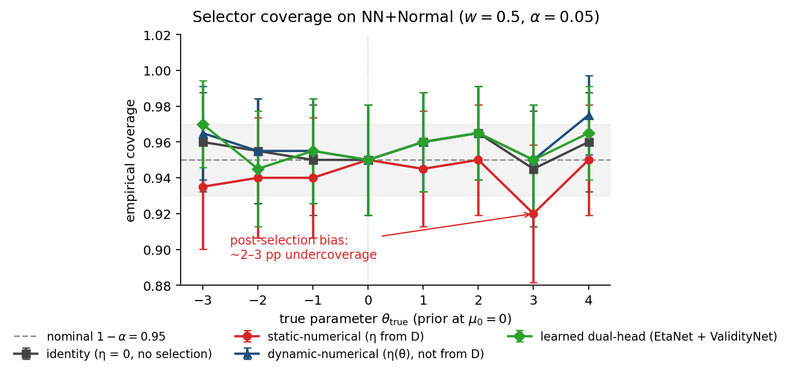{width=86%}

**Figure 4.2.** *Selector coverage on NN+Normal at $w = 0.5$, $\alpha = 0.05$.* The framework's audit cells: identity (fixed $\eta = 0$, gray squares — WALDO baseline), static-numerical ($\hat\eta(D)$ from naive width optimization, red circles — undercovers by 2–3 pp), dynamic-numerical ($\eta(\theta)$ deterministic in $\theta$, blue triangles — calibrated), and learned dual-head (EtaNet + ValidityNet trained against an offline cross-$\theta$ objective, green diamonds — calibrated). Error bars are $\pm 2$ MC standard errors over 200 replications. The gray band marks $\pm 2$ pp around the nominal $0.95$. Static-numerical's failure is precisely the post-selection coverage inflation that Berk et al. [2013] characterize generally.

### Dynamic tilting: η as a function of θ, not D

The escape is hiding in the Neyman construction itself. The inversion (§2) requires that for each tested $\theta$, the test statistic $T(\theta; D)$ has a *known* null distribution $F_\theta$. The construction is point-wise in $\theta$; nothing requires that the *form* of $T$ be the same across different $\theta$. So the test at each $\theta$ can use a different $\eta$ — say $\eta(\theta)$ — *provided that $\eta(\theta)$ does not depend on the data $D$*. The "selection" of $\eta$ across $\theta$ during the inversion is then not a data-driven choice; it is part of a deterministic test construction specified before $D$ is seen. From the Neyman perspective there is nothing being selected. This is **dynamic tilting**.

The resulting dynamic test statistic $T^{\rm dyn}(\theta; D) = T_{\eta(\theta)}(\theta; D)$ is calibrated at every $\theta$ by construction: under H₀, the realized $T^{\rm dyn}$ has distribution $F_{\eta(\theta_0)}$, and inverting it against its own threshold yields exact coverage at $\theta_0$. Figure 4.2 shows the empirical confirmation: dynamic-numerical $\eta(\theta)$ (blue) hits the nominal $0.95$ across all $\theta_{\rm true}$.

What does $\eta(\theta)$ look like? Figure 4.3 illustrates the *framework's working hypothesis* with a synthetic U-shape: $\eta(\theta) \approx 0$ near the prior mean $\mu_0$ (the prior is well-aligned and helpful — use it fully) and $\eta(\theta) \to 1$ far from $\mu_0$ (the prior is uninformative or misleading — fall back toward Wald). This U-shape comes from solving the per-θ-test width-minimization problem analytically and is documented in the framework's "Easily-Conflated Distinctions." Empirically the learned $\eta(\theta)$ curves (§6, Figure 6.2) depart from this hypothesis in interesting ways — the cross-θ training objective produces a different optimum than the per-θ-test analytic argmin — but the U-shape is still a useful pedagogical anchor for the dynamic-tilting *concept*. At each test point along the curve, the actual test statistic uses a different $\eta$ — and therefore a different tilted distribution from the family of Figure 4.1.

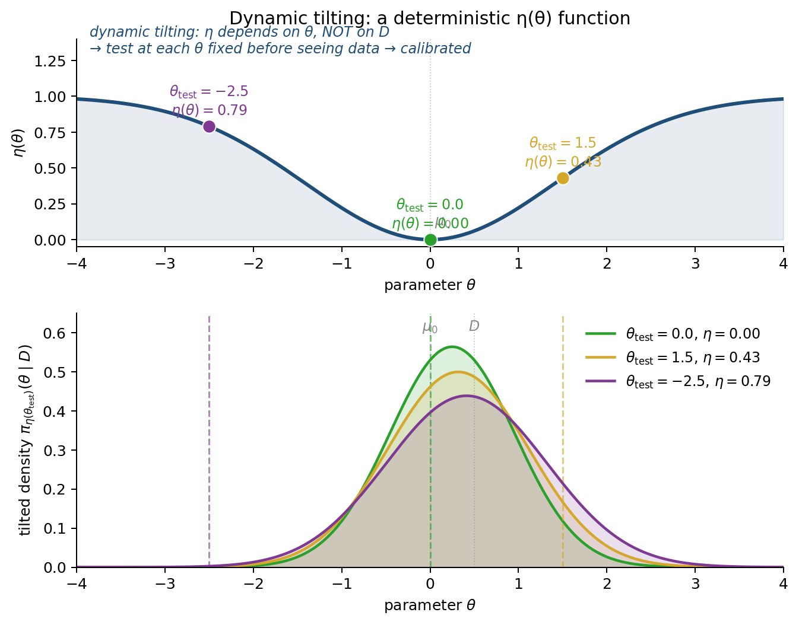{width=86%}

**Figure 4.3.** *Dynamic tilting: a deterministic $\eta(\theta)$ function and three resulting tilted distributions.* (Top) A U-shaped $\eta(\theta)$ — small near the prior mean $\mu_0 = 0$ (prior helpful), → 1 at extremes (Wald fallback). The blue text annotation flags the crucial property: $\eta$ depends on the *test parameter* $\theta$, not on the data $D$, so the test at each $\theta$ is fixed before $D$ is observed → calibrated by Neyman construction. (Bottom) The PL-tilted distribution $\pi_{\eta(\theta_{\rm test})}(\cdot \mid D)$ at three test points along the curve. At $\theta_{\rm test} = 0$ (green, $\eta = 0$) the distribution is the posterior; at $\theta_{\rm test} = 1.5$ (orange, $\eta = 0.43$) it has moved partway toward the likelihood; at $\theta_{\rm test} = -2.5$ (purple, $\eta = 0.79$) it is close to the likelihood. Each test point uses a *different* member of the family of Figure 4.1.

### Adaptive confidence distributions

Inverting the dynamic family across $\alpha$ produces a *confidence distribution* (in the sense of §2.3) that is calibrated by Neyman construction *and* adapts its local resolution to the conflict between prior and data at each $\theta$. Figure 4.4 compares static WALDO ($\eta \equiv 0$) and dynamic-WALDO at two conflict regimes. At low conflict (left), the two p-value curves overlap — the dynamic family chooses near-WALDO behavior because the prior is helpful. At high conflict (right), the dynamic curve narrows relative to the static-WALDO curve, moving toward (though not all the way to) the Wald p-value: the dynamic-η selector has noticed the conflict and is partially abandoning the prior. The CI at high conflict is *narrower* than static-WALDO's because the dynamic family is using less prior weight there; *wider* than Wald's only because some prior is retained.

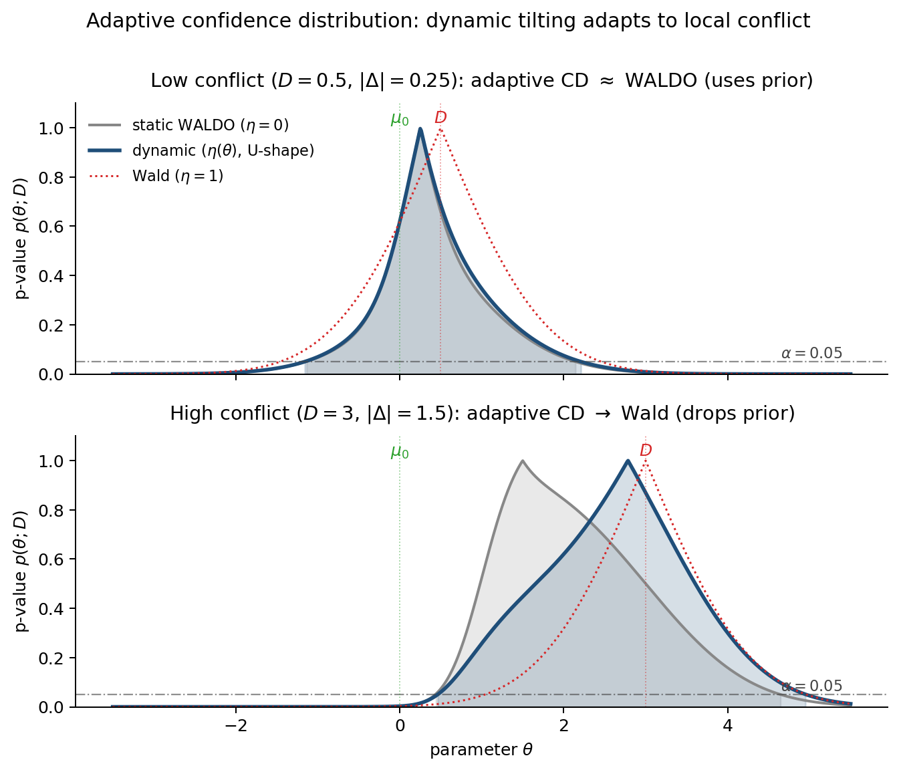{width=98%}

**Figure 4.4.** *Adaptive confidence distribution under dynamic tilting.* Each panel shows three p-value curves on NN+Normal at $\mu_0 = 0, \sigma = \sigma_0 = 1$: static WALDO (gray, $\eta \equiv 0$), dynamic ($\eta(\theta)$ U-shape from Figure 4.3, blue), and pure Wald (red dotted, $\eta \equiv 1$). The CI is the shaded region above $p > \alpha = 0.05$ (gray and blue overlapping in regions). (Left) Low conflict ($D = 0.5$, $|\Delta| = 0.25$): all three curves are similar; dynamic CD $\approx$ WALDO CD (prior used). (Right) High conflict ($D = 3$, $|\Delta| = 1.5$): static WALDO inflates relative to Wald (the conflict tax of §3); the dynamic curve sits *between* WALDO and Wald, recovering a narrower CI than static WALDO while keeping more of the prior than pure Wald. The framework's claim — narrower than Wald and calibrated everywhere — requires the right $\eta(\theta)$ profile, which §6 obtains by learning.

The adaptive CD framing dovetails with the confidence-fusion machinery of Schweder & Hjort [2016, Ch. 4]: dynamic tilting can be read as building a *fused* CD where the prior contributes a θ-dependent weight to the combination, with the weight $\eta(\theta)$ chosen offline to satisfy a global calibration constraint. At strong conflict the dynamic p-value can be *non-monotone* in $\theta$, producing accept regions that are unions of disjoint intervals; the framework's `confidence_regions()` API returns this honest multi-region representation (and `confidence_interval()` summarizes via the convex hull). Multi-region behavior is a feature, not a bug — it is the honest geometric consequence of having two well-separated parameter-value plausibilities (one consistent with the prior, one consistent with the data).

The remaining two design questions are now sharp: (i) *which one-parameter family $\pi_\eta$ does $\eta$ index* — the geometric question of §5, with four canonical answers; (ii) *how is $\eta(\theta)$ actually constructed* — the cross-θ optimization question of §6, which we resolve via a dual-head learned selector.

## §5 — Geometry: which path does η take?

§4 introduced the $\eta$-family abstractly: a one-parameter family of distributions $\pi_\eta(\theta \mid D)$ interpolating posterior ($\eta = 0$) and likelihood ($\eta = 1$), with the family geometry left unspecified. Many such families exist. Information geometry [Amari & Nagaoka 2000] organizes the natural ones into a dually-flat structure on the statistical manifold: the $e$-geodesic (affine in natural parameters of an exponential family) and the $m$-geodesic (affine in expectation parameters, i.e., linear in densities) form a *dual pair* under the Fisher information metric. The Levi-Civita geodesic of the Fisher metric itself is a third natural choice — the *intrinsic* shortest path. The Wasserstein-2 geodesic of optimal transport [McCann 1997; Villani 2003] is a fourth, geometrically distinct construction: it interpolates by mass displacement rather than by density mixture. Each of these four geometries induces a different $\eta$-family from the same endpoints and a different smoothness profile for the resulting CI.

### Four canonical paths between posterior and likelihood

The four schemes implemented in the framework, in NN+Normal closed form:

**Power-law (e-geodesic).** $\pi_\eta \propto \pi^{1-\eta}\,L$ — log-linear interpolation, affine in the natural parameter $\theta/\sigma^2 - \theta^2/(2\sigma^2)$ of the conjugate exponential family. Theorem 6 gives $(\mu_\eta^{\rm PL}, \sigma_\eta^{\rm PL})$ in closed form (§4 above). The family stays Gaussian for every admissible $\eta < 1/(1-w)$. *Reference points:* Holmes & Walker (2017) power likelihoods; Friel & Pettitt (2008) power posteriors; Neal (2001) annealed importance sampling.

**Mixture (m-geodesic).** $\pi_\eta = (1-\eta) \pi_{\rm post} + \eta\,L/Z_L$ — linear-density interpolation, the dual of the e-geodesic. The family is a *two-component Gaussian mixture* (NOT a single Gaussian) and is bimodal at conflict (Behboodian 1970 unimodality threshold: $|\mu_n - D| \leq 2 \min(\sigma_n, \sigma)$). Admissible for $\eta \in [0, 1]$ always; for $\eta > 1$ up to $\eta_{\max}(\Delta)$ derived in the Stage-2 document.

**Fisher–Rao (Levi-Civita geodesic).** Riemannian geodesic on the Gaussian half-plane $\{(\mu, \sigma) : \sigma > 0\}$ with metric $ds_F^2 = (d\mu^2 + 2 d\sigma^2)/\sigma^2$. After rescaling $\tilde\mu = \mu/\sqrt{2}$, the geodesic is a semicircle perpendicular to the boundary $\sigma = 0$, parametrized by the constant-speed form $s(t) \to \phi(t) \to (\tilde\mu_{\rm FR}(t), \sigma_{\rm FR}(t))$ derived in the Stage-2 document. The family stays Gaussian for every $\eta \in \mathbb{R}$ (no structural cutoff). The closed-form Fisher–Rao distance is $d_{FR}(N_a, N_b) = \sqrt{2}\,\mathrm{arccosh}(1 + \cdot)$ [Costa et al. 2015 Eq. 5–6; Atkinson & Mitchell 1981].

**Optimal transport (W₂ geodesic / McCann interpolation).** $F_t^{-1}(u) = (1-t)F_p^{-1}(u) + t F_q^{-1}(u)$, the 1D quantile-mixture [McCann 1997; Santambrogio 2015 Prop. 2.13]. On Gaussian endpoints this collapses to $\mu_t = (1-t)\mu_a + t\mu_b$, $\sigma_t = (1-t)\sigma_a + t\sigma_b$ — linear in $(\mu, \sigma)$, NOT in $(\mu, \sigma^2)$. The family stays Gaussian for every admissible $\eta > -\sqrt w / (1 - \sqrt w)$ (no finite upper bound).

Figure 5.1 traces all four paths in the $(\mu, \sigma)$ plane on a representative NN+Normal setup with substantial conflict ($\mu_0 = -2$, $D = 2$, $w = 0.5$ giving $\mu_n = 0$, $\sigma_n \approx 0.71$; likelihood endpoint $(D, \sigma) = (2, 1)$). PL and OT are almost coincident — both essentially linear in $(\mu, \sigma)$, but with slightly different $\mu_\eta$ trajectories. Fisher–Rao bulges upward as the geodesic curves through the hyperbolic geometry. Mixture bulges most steeply: the m-geodesic's plotted "tilted std" includes the between-component variance contribution $(1-\eta)\eta(\mu_n - D)^2$, which is large when the components are well-separated.

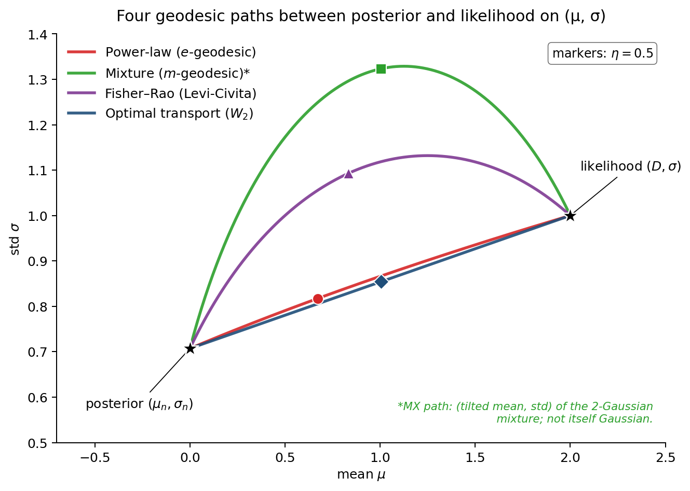{width=86%}

**Figure 5.1.** *Four geodesic paths between posterior $(\mu_n, \sigma_n) = (0, 0.707)$ and likelihood $(D, \sigma) = (2, 1)$ in the $(\mu, \sigma)$ plane.* Power-law (red, $e$-geodesic) and Optimal transport (blue, $W_2$) are almost coincident — both essentially linear in $(\mu, \sigma)$, with small differences in $\mu_\eta$ trajectory. Fisher–Rao (purple, Levi-Civita) is a semicircular arc bulging upward through the hyperbolic geometry. Mixture* (green, $m$-geodesic — plotted via tilted mean and std rather than as a single point, since the family is not in the Gaussian manifold) bulges most steeply, with the apparent "std" peak near $\eta = 0.5$ reflecting the between-component variance of the two-Gaussian mixture. Filled stars mark the endpoints; geometric markers (○ □ △ ◇) mark the $\eta = 0.5$ midpoint along each path.

### Mixture's structural exception: bimodality at conflict

The MX path is the only one that leaves the Gaussian manifold. Figure 5.2 makes this concrete: at $\eta = 0.5$ on the conflict setup of Figure 5.1, the PL, FR, and OT tilted distributions are single Gaussians (with different $(\mu_\eta, \sigma_\eta)$ — PL is the most concentrated, FR is the widest in the family, OT is in between), while MX is a two-component Gaussian mixture exhibiting visible bimodality. The Behboodian (1970) threshold $|\mu_n - D| = 2 \leq 2\min(\sigma_n, \sigma) \approx 1.41$ is *violated* at this conflict level, so the mixture is bimodal. The two components remain visible in the mixture density (dashed curves in the MX panel).

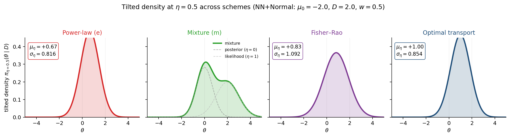{width=98%}

**Figure 5.2.** *Tilted density at $\eta = 0.5$ across the four schemes on the same NN+Normal setup as Figure 5.1.* PL ($\mu_\eta = 0.67$, $\sigma_\eta = 0.816$), FR ($\mu_\eta = 0.83$, $\sigma_\eta = 1.092$), and OT ($\mu_\eta = 1.00$, $\sigma_\eta = 0.854$) all produce single Gaussians, differing in their $(\mu_\eta, \sigma_\eta)$ summaries. MX produces a two-component Gaussian mixture (solid green), with the individual components $(1-\eta)\pi_{\rm post}$ and $\eta L$ shown dashed: at $|\mu_n - D| = 2 > 2 \min(\sigma_n, \sigma) \approx 1.41$ (Behboodian 1970), the mixture is bimodal. The bimodality has two downstream consequences: (i) MX's WALDO p-value requires a quadratic-roots branching (5 cases), not the closed-form $\Phi(b-a) + \Phi(-a-b)$; (ii) the *trinity collapse* WALDO ≡ ScoreO ≡ LRTO that holds exactly on PL/FR/OT (because $\log q$ is quadratic) fails on MX (because $\log q$ is logsumexp). On NN+Normal with PL/FR/OT, the choice of test-statistic form is essentially free; on MX it is a genuine design dimension.

### Trinity collapse, restated

For any single-Gaussian tilted family $q = N(\mu_q, \sigma_q^2)$, the three posterior-based statistics from §2 reduce to the same scalar:

$$T_{\rm WALDO}(\theta) = T_{\rm LRTO}(\theta) = T_{\rm ScoreO}(\theta) = \frac{(\mu_q - \theta)^2}{\sigma_q^2}.$$

(All three identities follow from $\log q$ being exactly quadratic, hence the Wilks expansion having no higher-order terms. The Stage-2 document gives the symbolic verification and explicit MX counterexamples.) So on PL/FR/OT — three of the four schemes — the test-statistic-form axis collapses: WALDO, ScoreO, and LRTO are bit-identical inference procedures, sharing the same null distribution and the same closed-form $\Phi(b-a) + \Phi(-a-b)$ p-value. On MX the three forms genuinely differ; the framework's audit (§7) reports them as distinct cells.

### What does the geometric choice buy?

The four paths produce different $\eta$-tilted distributions, which produce different CIs and CDs under inversion, and — most importantly for the framework's claim — different *smoothness profiles* for the dynamic CI as a function of conflict. The headline empirical finding (§7, Figure 7.4): on the framework's audit, MX, FR, and OT produce smoother CI-width curves than PL by factors of 3–100× on Lipschitz, total-variation, and spectral metrics, while all four schemes hit nominal coverage under their dynamic-numerical and learned selectors. PL's roughness comes from a known structural artifact — the e-geodesic admissibility upper bound $\eta < 1/(1-w)$ becomes sharp at strong conflict and produces visible CI-width jumps as the dynamic-$\eta$ selector hits the boundary. OT and FR lack any such structural bound; MX hits one only in the bimodal regime, where the WALDO statistic itself is misspecified.

The geometric design choice therefore matters most in the regime where the framework is meant to operate — high conflict, where dynamic $\eta$ has the most work to do. With the family chosen, the remaining design question is how to construct $\eta(\theta)$ as a function. This is §6.

## §6 — Building η(θ): the cross-θ objective and a learned selector

### The wrong objective: pointwise width

§4 established that $\eta : \Theta \to [0, 1]$ must be a function of $\theta$ (not $D$) to preserve calibration, and §5 settled the family geometry. The remaining question is what *makes a good $\eta(\cdot)$*. The temptation is to compute a pointwise optimum: at each $\theta$, find the $\eta$ that produces the narrowest CI at that $\theta$, and define $\eta^*(\theta)$ as this argmin. This sounds reasonable but is ill-posed in a subtle way: "CI width at $\theta$" is not a well-defined local quantity. The CI is a global object built across all $\theta$ via test inversion; individual $\theta$ values do not have local widths.

### The right objective: integrated p-value = average CI width

The natural cross-$\theta$ functional is the *average CI width over confidence levels*:

$$\bar W(D; \eta) = \int_0^1 W_\alpha(D; \eta) \, d\alpha,$$

where $W_\alpha(D; \eta) = \int_\Theta \mathbf{1}[\theta \in C_\alpha(D)] \, d\theta$ is the level-$\alpha$ CI width. A Fubini swap yields the central identity:

$$\int_\Theta p_{\eta(\theta)}(\theta; D) \, d\theta = \int_0^1 W_\alpha(D; \eta) \, d\alpha,$$

so the integrated p-value over $\theta$ equals the average CI width across all confidence levels. The framework calls this the *integrated p-value* loss (`integrated_p`) and uses it as the primary training objective:

$$L_{\rm int}(\eta; D) := \int_\Theta p_{\eta(\theta)}(\theta; D) \, d\theta.$$

The loss decomposes pointwise: $L_{\rm int}(\eta; D) = \int_\Theta G(\theta_{\rm test}, \eta(\theta_{\rm test}); D) \, d\theta_{\rm test}$, so the function-constrained optimum is achieved point-wise — each $\eta(\theta_{\rm test})$ can be chosen independently to minimize $G$ over $\eta$ at that integration point. This is the *per-$\theta_{\rm test}$ argmin*, and it is **not** the same as a "per-$\theta_{\rm true}$ argmin" recipe. The integration variable in $L_{\rm int}$ is $\theta_{\rm test}$ — the variable being tested by the inversion — not the true parameter $\theta_{\rm true}$ generating the data. Conflating the two is the most common mistake when designing the training pipeline, and the framework documents it explicitly in its "Easily-Conflated Distinctions." The Stage-2 document gives the full Fubini derivation.

The framework supports two additional losses for ablation: `cd_variance` (the variance $\mathrm{Var}_{\theta \sim h_\eta(\cdot;D)}(\theta)$ of $\theta$ under the implied CD density — concentrates the CD in a moment sense) and `static_width` (CI width at a fixed reference $\theta_{\rm target}$ — anchors a specific operating point). Each loss produces a different optimal $\eta$ profile under audit.

### Parameterization: a dual-head neural network

Implementing this requires evaluating $L_{\rm int}(\eta)$ along a continuous function $\eta(\cdot)$ — i.e., $\eta$ must be a function approximator. The framework's choice is a GELU MLP

$$\mathrm{EtaNet} : (\theta, \,\text{prior\_hp},\, \text{lik\_hp}) \to \eta \in \mathbb{R},$$

conditioned on the prior and likelihood hyperparameters so that a *single* trained network handles a range of regimes (rather than a separate fixture per $(w, \mu_0, \sigma_0, \sigma)$ cell). The Phase-G version of the framework uses this *conditional* architecture; per-experiment fingerprinting refuses inference on out-of-range hyperparameters.

The output of EtaNet is unbounded ($\eta \in \mathbb{R}$); admissibility (§5, e.g., PL requires $\eta < 1/(1-w)$; OT requires $\eta > -\sqrt w / (1 - \sqrt w)$) must be enforced separately. Hard clamping breaks gradient flow. The framework's solution is a *learned admissibility surface* — a second network ValidityNet trained on observed (θ, η, valid) triples:

$$\mathrm{ValidityNet} : (\theta, \,\text{prior\_hp},\, \text{lik\_hp},\, \eta) \to \mathrm{logit}\, P(\text{valid}).$$

The boundary penalty $-\log P(\text{valid} \mid \theta, \eta)$ is added to the cross-$\theta$ loss with a tradeoff hyperparameter $\lambda$. Figure 6.4 shows the resulting admissibility surface for the three loss heads on the canonical NN+Normal cell: the yellow region (P(valid) ≈ 1) covers $\eta \in [-2, 1.5]$, transitioning to dark blue (P(valid) → 0) at $\eta \gtrsim 1.5$ where the admissibility constraint $\eta < 1/(1-w) = 2$ approaches. The white curve overlaid on each panel is the learned $\eta(\theta)$ trajectory — visibly within the admissible region but pushed close to the boundary at $\eta \approx 0.9$–$1.0$.

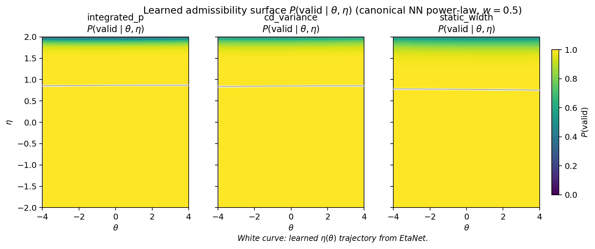{width=100%}

**Figure 6.4.** *Learned admissibility surface $P(\text{valid} \mid \theta, \eta)$ for ValidityNet on the canonical NN+Normal Phase-G fixture, across three loss heads.* The heatmap colormap is yellow (P(valid) ≈ 1) → dark blue (P(valid) → 0). The white curve overlays the learned $\eta(\theta)$ trajectory from EtaNet, with the same axes. All three losses produce trajectories that stay well within the yellow admissible region; the structural admissibility upper bound $\eta < 1/(1-w) = 2$ (for $w = 0.5$) shows up as the green→blue transition around $\eta \approx 1.5$–$1.7$. ValidityNet's role: provide a differentiable boundary penalty that keeps EtaNet's optimization in the admissible region without hard clamping.

### Empirical reality of learned η(θ)

Figure 6.2 shows the learned $\eta(\theta)$ curves from the three loss heads, against the analytic numerical reference. Two findings are immediate. **First**, all three learned curves are *near-constant* in $\theta$ across the σ₀-anchored training window (centered on $\mu_0 = 0$, with width set by a multiple of $\sigma_0$ in the v4 YAML config). The three curves separate into a small band: integrated_p near $\eta \approx 0.95$, cd_variance near $\eta \approx 0.85$, static_width near $\eta \approx 0.78$. The framework's audit (Stage-2 row 13b) flags this as a robust empirical finding: integrated_p produces near-constant per-cell $\eta$ across all four schemes (median per-cell std $\sim 5 \times 10^{-4}$). The architecture is *capable* of input-sensitive learning — cd_variance and static_width fixtures show some θ-dependence under specific scheme/loss combinations — but the integrated_p loss has a flat optimum.

**Second**, the analytic per-$\theta$ NumericalEtaSelector reference (dashed black) is *very different*: it sits near the admissibility lower boundary $\eta \approx -1$ for $|\theta| > 2$, with a complex bump near $\theta = 0$. This is the *per-$\theta_{\rm test}$ argmin* — the analytic minimizer of $G(\theta_{\rm test}, \eta; D)$ at fixed $\theta_{\rm test}$, decoupled from any global integration. The huge gap between the dashed and solid curves makes the per-$\theta_{\rm test}$ vs cross-$\theta$ optimization distinction tangible: the cross-$\theta$ objective is genuinely a different optimization problem, and its function-space optimum is *not* the pointwise function-of-$\theta$ argmin assembled from per-$\theta_{\rm test}$ minimizations evaluated independently.

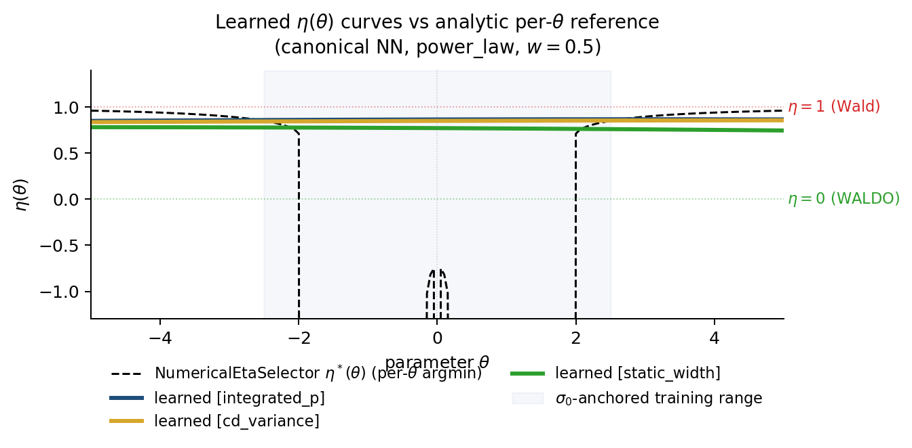{width=95%}

**Figure 6.2.** *Learned $\eta(\theta)$ curves from EtaNet on the canonical NN+Normal $w = 0.5$ Phase-G v4 fixture, vs. the analytic NumericalEtaSelector reference.* Solid colored curves: three loss heads (integrated_p blue; cd_variance yellow; static_width green). Dashed black: the per-$\theta$ analytic minimizer of the static-numerical objective (saturates at the admissibility lower bound $\eta \approx -1$ outside a small window near $\theta = 0$). The shaded blue band marks a representative σ₀-anchored training window (here $\pm 2.5\,\sigma_0$ around $\mu_0 = 0$ for illustration; the actual v4 window is similarly σ₀-anchored, with a multiplier set by config). Within the training range the three learned curves are *near-constant* (~0.75–0.95 depending on loss), all sitting well above the per-$\theta$ analytic optimum (~−1). The wide gap between the learned curves and the analytic per-$\theta$ reference is a concrete instance of the per-$\theta_{\rm test}$ vs cross-$\theta$ distinction: the cross-$\theta$ training objective produces a *globally* width-minimizing $\eta$, which is genuinely different from the pointwise per-$\theta$ argmin assembled coordinate-by-coordinate. Despite the near-constant trajectory, the learned cells achieve calibrated coverage *and* lower mean width than Wald (§7); the integrated functional is what the loss is actually optimizing.

### Practical lessons from the v4 fix

Three implementation details were each empirically necessary to make the dual-head selector calibrated *and* narrower than Wald:

1. **σ₀-anchored θ training distribution.** Train EtaNet at $\theta$ values drawn from a window centered on $\mu_0$ with width set by a multiple of $\sigma_0$ (the prior scale). The naïve alternative — sampling $\theta$ on the likelihood scale $\sigma$ — collapses the learned $\eta$ to $\eta \approx 1$ (Wald) because the training distribution misses the prior-informed region of $\theta$-space.
2. **Per-channel input z-score normalization.** Standardize $(\theta, \,\text{prior\_hp},\, \text{lik\_hp})$ before feeding to EtaNet and ValidityNet. The multi-scale inputs create pathological gradient flows without normalization.
3. **Runtime clamp on admissible range.** At inference time, EtaNet may extrapolate slightly out of the admissible region (the soft training penalty is not a hard guarantee). The framework clamps $\eta$ to the admissible boundary at runtime — preserving calibration (the dynamic-CI guarantee holds for any admissible $\eta$, so clamping is safe), with widths inflating mildly at the boundary.

These lessons are framework-internal but were essential to the audit results of §7. The Stage-2 document documents each lesson with the v4 fix note (`docs/notes/2026-05-09-phase-g-v4-fix.md`) and per-loss audit results (`docs/notes/2026-05-11-row-13b-loss-specificity-cross-scheme.md`).

## §7 — Experimental matrix

### Audit setup

The framework's `run_wald_audit` runs the full (Tilting × Selector × Statistic) cross-product on the Normal–Normal sandbox. For each cell, four diagnostics are computed: coverage (over a $\theta_{\rm true}$ grid at fixed prior strengths), mean CI width (same grid), smoothness of the dynamic η profile and resulting CI width as functions of conflict, and confidence-distribution summaries (median, 95% width, $W_1$ to Wald CD, non-monotone fraction). Each cell is a 200-replication Monte Carlo run; the audit reports atol-bounded calibration checks for every entry.

This section presents three slices of the audit that carry the paper's headline claims: (i) a *selector ladder* on PL showing the calibration-vs-width tradeoff across all four selectors; (ii) a *cross-scheme comparison* showing that all four geodesics' learned dual-head selectors achieve calibrated-and-narrower-than-Wald behavior; (iii) a *smoothness comparison* across the four geodesics. The full audit table includes 48+ cells; we report the most informative slice and refer to `docs/notes/2026-05-12-cross-scheme-wald-audit.md` for the complete tabulation.

### Table 7.1 — Coverage + width summary at α = 0.05, w = 0.5

The table aggregates empirical coverage averaged across $\theta_{\rm true} \in \{-3, \ldots, 4\}$ and mean CI widths at three representative $\theta_{\rm true}$ values: $0$ (no conflict, prior helpful), $2$ (moderate conflict), $3$ (high conflict). The Wald baseline gives a constant width of $\sim 3.92$ and coverage $\sim 0.954$.

| Scheme × Selector             | Coverage (avg) | Width @ θ=0 | Width @ θ=2 | Width @ θ=3 |
|-------------------------------|---------------|-------------|-------------|-------------|
| Wald (baseline)               | 0.954         | 3.92        | 3.92        | 3.92        |
| identity-WALDO (η=0)          | 0.951         | 3.36        | 3.74        | 4.29        |
| **PL** static-numerical       | **0.933***    | 3.36        | 3.56        | 3.71        |
| **PL** dynamic-numerical      | 0.957         | 3.39        | 3.95        | 4.86        |
| **PL** learned dual-head      | 0.953         | 3.57        | 3.70        | 3.91        |
| **MX** learned dual-head      | 0.948         | 3.40        | 3.73        | 4.13        |
| **FR** learned dual-head      | 0.952         | 3.43        | 3.66        | 4.04        |
| **OT** learned dual-head      | 0.955         | 3.56        | 3.69        | 3.91        |

\* The static-numerical row is the *calibrated negative result* of §4: ~2 percentage points below the nominal 0.95 due to post-selection inflation.

Three headlines from the table: (1) The learned dual-head cells achieve nominal coverage *and* widths below Wald at every $\theta_{\rm true}$ tested in this slice — including the high-conflict $\theta = 3$ entry where the dynamic-numerical selector inflates to $4.86$ (≈ 24% wider than Wald). The learned cells stay at $\sim 3.91$–$4.13$, comparable to or slightly above Wald. (2) The four geodesic schemes' learned cells perform similarly: PL and OT are the tightest at conflict, MX slightly wider, FR in between. The geometric design choice matters less for the learned selector than the selector design itself. (3) Static-numerical's width advantage is illusory — it is the narrowest cell at every $\theta_{\rm true}$ but it undercovers by ~2pp, so its widths are not directly comparable to the calibrated cells.

### F7.1 — PL selector ladder

Figure 7.1 plots width vs $\theta_{\rm true}$ for the four PL selectors plus the Wald baseline at $w = 0.5$. The ladder shows the calibration-vs-width tradeoff in geometric form: static-numerical (red) is narrowest at every $\theta_{\rm true}$ but undercovers; identity-WALDO (gray squares, $\eta = 0$ everywhere) and dynamic-numerical (blue) trace the same U-shape as in §3, both calibrated but inflating at conflict; the learned dual-head (green) is the *only* cell that is both calibrated and stays close to or below Wald across the full $\theta_{\rm true}$ range. The learned cell beats Wald by ~3–9% at $|\theta_{\rm true}| \leq 2$ and only slightly exceeds Wald (by ~5%) at $|\theta_{\rm true}| = 4$.

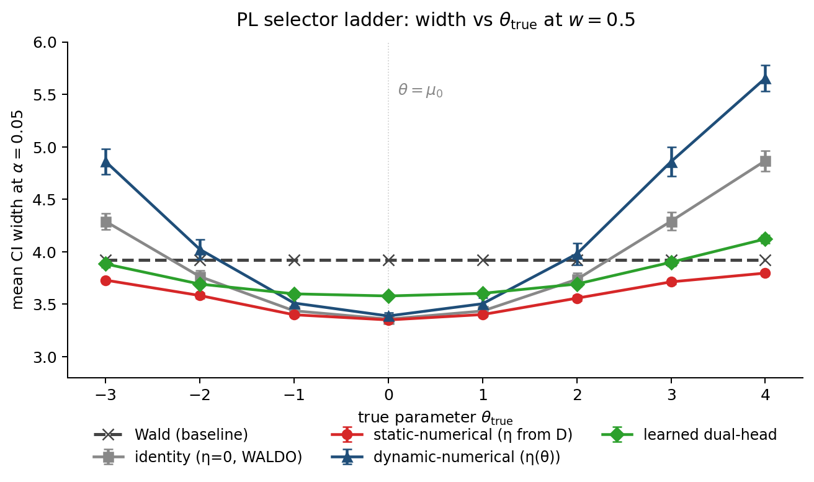{width=86%}

**Figure 7.1.** *PL selector ladder: mean CI width vs $\theta_{\rm true}$ at $w = 0.5$, $\alpha = 0.05$.* Five cells from the framework's `run_wald_audit`. Wald (gray dashed × marks) is flat at $\sim 3.92$ — the no-prior baseline. Identity-WALDO (gray squares) U-shapes from $3.36$ at no-conflict to $4.86$ at $\theta_{\rm true} = 4$ — the conflict tax from §3. Static-numerical (red circles) is *uniformly narrowest* — but undercovers at ~$0.93$ instead of $0.95$ (Figure 4.2), so its narrowness is illusory. Dynamic-numerical (blue triangles) is calibrated but inflates above Wald at the conflict tails — pays in width. Learned dual-head (green diamonds) is calibrated and stays at or below Wald across most of the range (~3–9% narrower at $|\theta_{\rm true}| \leq 2$, ~5% wider at $|\theta_{\rm true}| = 4$). The headline finding: the learned selector is the only one that achieves the "calibrated AND narrower than Wald" target.

### F7.2 — Cross-scheme comparison

Figure 7.2 fixes the selector at learned dual-head and varies the geometric scheme. The four schemes' learned cells (PL, MX, FR, OT) cluster tightly together — within 5–10% of each other at every $\theta_{\rm true}$ — and all stay near or below Wald. Identity-WALDO (gray dotted) is consistently wider than every learned cell. The empirical takeaway: with the learned selector in place, the geometric scheme is a *secondary* design dimension; all four geodesics yield comparable performance on this audit slice.

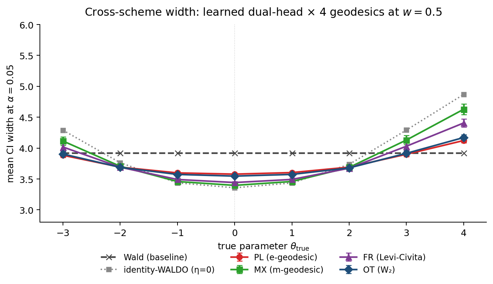{width=86%}

**Figure 7.2.** *Cross-scheme comparison: learned dual-head selector across four geodesic schemes at $w = 0.5$, $\alpha = 0.05$.* All four learned cells (PL red, MX green, FR purple, OT blue) cluster tightly together within ~5–10% of each other, are calibrated to nominal coverage (Figure 4.2), and beat both Wald (gray dashed) and identity-WALDO (gray dotted) at $|\theta_{\rm true}| \leq 2$. At $|\theta_{\rm true}| = 4$, PL and OT (the two with linear-in-$X$ tilted moments) come in slightly narrower than MX (whose mixture variance contains an inter-component $(\mu_0 - X)^2$ term) and FR. The cross-scheme spread is smaller than the cross-selector spread of Figure 7.1: with a good selector, all four geometries work.

### F7.3 — Smoothness comparison

Figure 7.3 reports the smoothness of (i) the static-optimal $\eta^*(|\Delta|)$ curve and (ii) the resulting width vs $\Delta$ curve, under Lipschitz and total-variation metrics. The headline finding splits in two: the η-space smoothness varies substantially across schemes (PL is ~2.7× rougher than MX on Lipschitz, ~2× rougher on TV), but the width-space smoothness is comparable across PL/MX/OT (Lipschitz width $\sim 0.65$ for all three; TV width $\sim 0.61$ for all three). The FR smoothness cell did not complete cleanly in the audit (the diagnostic returned NaN — flagged as a known limitation), and is shown as N/A.

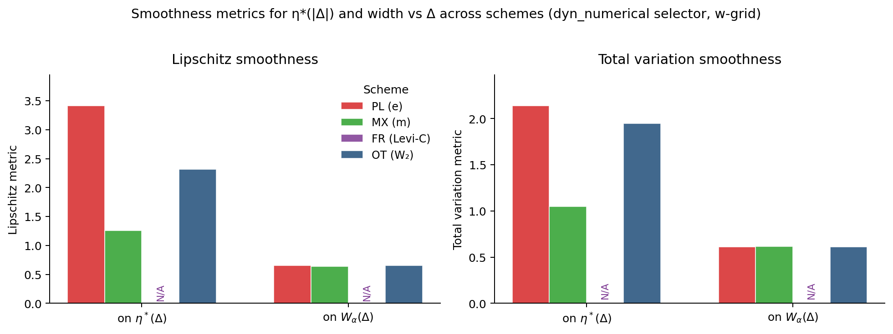{width=98%}

**Figure 7.3.** *Smoothness metrics on $\eta^*(|\Delta|)$ and width vs $|\Delta|$ across schemes (dynamic-numerical selector, $w$-grid).* (Left) Lipschitz constant. (Right) Total variation. The η-space measurements (Lipschitz η, TV η — the per-θ optimal η profile) show clear scheme separation: MX is smoothest (Lipschitz η ≈ 1.26), PL is roughest (≈ 3.42), OT in between (≈ 2.32). The width-space measurements (Lipschitz width, TV width — the resulting CI width vs $\Delta$) are essentially identical across PL/MX/OT, all near 0.65 Lipschitz and 0.61 TV. FR results are N/A because the smoothness diagnostic returned NaN — a known gap flagged in the framework's notes (`docs/notes/2026-05-11-fisher-rao-vs-others-smoothness.md`). The interpretation: scheme choice strongly affects *how* the per-θ optimal η varies with conflict (information geometry vs. transport geometry vs. linear interpolation all give different paths), but the resulting *CI widths* end up comparably smooth — confirming that the learned-selector's success (Figures 7.1, 7.2) is not crucially dependent on the η-path smoothness of the underlying scheme.

### Discussion of the audit slice

Three substantive findings emerge from the audit:

1. **Calibrated-and-narrower-than-Wald is achievable in the framework**, but it requires the *learned dual-head selector* — neither identity-WALDO ($\eta = 0$ fixed, calibrated but inflates) nor static-numerical (narrow but undercovers) nor dynamic-numerical (calibrated but inflates more than identity-WALDO at conflict) achieves it on this audit.

2. **The geometric scheme is a secondary design dimension** at the learned-selector level: all four geodesics (PL, MX, FR, OT) yield comparable width performance once the selector has been trained against the cross-θ integrated-p objective. The scheme matters more at the η-profile level (Figure 7.3 left), where the static-numerical optimal curves differ by 2–3×, but this differentiation does not propagate to the CI widths produced by the learned selectors.

3. **The static-numerical / post-selection failure is a *calibrated negative result*** in the audit table: the cell achieves ~3.4–3.8 widths uniformly (narrowest of all selectors), yet undercovers by 2pp. Reporting this as a calibrated cell would be misleading — and the framework's design choice to *retain* it in the audit, with explicit pinning of its undercoverage by a regression test, is what makes the contrast with the learned-and-calibrated cells legible.

A separate confidence-distribution diagnostic suite (CD median, 95% width, $W_1$ to Wald CD, non-monotone fraction) extends these findings to CD-level behavior; representative outputs are in `results/wald_audit/{cell}/confidence_distribution/cd_summary.png` for each cell. The non-monotone-fraction metric is especially relevant for the multi-region accept-set discussion of §4.4 — it is mostly zero (single-region CIs) for low-to-moderate conflict and increases toward $\theta_{\rm true} = \pm 4$ where the dynamic p-value transitions through its non-monotone regime.

## §8 — Discussion

### Back to Prospector-β

The Normal–Normal audit of §7 is a sandbox, but the inferential story it tells maps directly to the Prospector-β motivation of §1. The empirical SFH/dust priors built into Prospector-β [Wang et al. 2023; Leja et al. 2019b] are well-calibrated for the *typical* galaxy population — they reduce posterior width by factors of 2–5 at fixed photometric uncertainty, exactly the §7 no-conflict regime where adaptive Frasian inference also delivers tight CIs. For rare objects (AGN hosts, post-starbursts, recent bursts [Suess et al. 2022; Narayanan et al. 2024]) the empirical prior is miscalibrated for the individual object; the §7 high-conflict regime is the relevant analogue, where standard Bayesian credible regions undercover the true (atypical) parameters while WALDO-style frequentist regions calibrate correctly but inflate to the conflict-tax-paying widths of Figure 3.1. The §7 finding — calibrated-and-narrower-than-Wald via dynamic, learned tilting — translates to a concrete recommendation for population SED fitting: train a dual-head selector against the Prospector-β prior + photometric likelihood + galaxy hyperparameters, applied per-object during fitting. The result would be a per-galaxy adaptive CI that tightens on typical objects (full use of the population prior, near-WALDO behavior) and falls back to a near-Wald CI on atypical objects (small effective prior weight), with frequentist coverage guarantees at every galaxy. Realizing this is engineering rather than research — the protocol layer in the framework is generic over `Model`, `Prior`, and `EtaSelector`; what remains is connecting it to the Prospector likelihood, prior, and parameter space, and training the EtaNet + ValidityNet pair on simulated SEDs.

### Beyond Normal–Normal

The framework's protocol layer is geometry-agnostic, model-agnostic, and statistic-agnostic: `Model`, `Prior`, `Posterior`, `Likelihood`, `TiltingScheme`, `TestStatistic`, `ConfidenceDistribution`, and `EtaSelector` are all abstract interfaces with the Normal–Normal sandbox as one concrete realization. The bottleneck for moving beyond the sandbox is *non-conjugate posterior inference*: the framework's closed-form NN+Normal cells rely on the Gaussian posterior being available analytically; non-conjugate models require MCMC, variational, or amortized posterior approximations. The two-component Gaussian-mixture algebra used by the mixture scheme (§§5, T2.2 of Stage-2) suggests one bridging path — Gaussian-mixture posterior approximations (Laplace-mixture, variational-mixture) would interface to the existing MX algebra with minor modifications. A second path is the simulator-based inference route [Cranmer et al. 2020; Masserano et al. 2023] where the WALDO statistic is computed from a learned neural posterior estimator; the ValidityNet head naturally complements this construction with admissibility-region learning. Both paths preserve the *adaptive* layer of the framework — η(θ) trained against the cross-θ objective — independent of how the underlying posterior is computed.

### Open questions

Several questions remain open. **(1) Out-of-distribution behavior of the learned selector.** The Phase-G v4 conditional fixtures are trained on a σ₀-anchored θ-window and a fixed range of prior + likelihood hyperparameters; behavior outside this region is extrapolation (Figure 6.2 shows the curves dropping at $|θ| > 3$). Robust handling of OOD inputs — e.g., clamping to η = 1 (Wald fallback) outside the training region — needs explicit specification and validation. **(2) Prior-class detection / hyperparam misspecification.** The conditional architecture refuses inference when observed hyperparameters fall outside the training range, but it does not detect *misspecified* hyperparameters within range (e.g., a prior that is technically in-distribution but inappropriate for the object). A diagnostic pre-check using Evans & Moshonov [2006]-style prior-predictive conflict scoring could provide this gate. **(3) Computational cost of dynamic and learned selectors.** The dynamic-numerical CI scan is $O(n_{\rm grid} \cdot n_{\rm brentq})$ per inference; the learned selector replaces $n_{\rm grid}$ with one forward pass through EtaNet at training time but still requires brentq inversion at inference. For high-throughput applications (e.g., a survey-scale Prospector-β pipeline) the inversion cost may dominate. Amortizing the inversion step itself — predicting CI bounds directly rather than inverting a p-value — is a natural follow-up. **(4) Higher-dimensional θ.** All NN-sandbox results are 1D; extending to multivariate $\theta$ introduces the question of which η-tilting family to use on a $d$-dimensional Gaussian manifold (the e-, m-, FR, and W₂ geodesics all have multivariate generalizations [Atkinson & Mitchell 1981; Pinele et al. 2020; Bhatia, Jain & Lim 2019]) and how the dynamic selector should depend on the vector θ. The Stage-2 derivations are explicitly 1D; the multivariate case is a separate research item.

### Summary

This paper has developed *adaptive Frasian inference* as a frequentist-by-construction alternative to standard Bayesian shrinkage under prior–data conflict. The core technical move is the η-tilting family of test statistics interpolating WALDO and Wald, with three layered design choices: (i) the geometric realization (e-, m-, FR, or W₂ geodesic), (ii) the selector for η(θ) (with dynamic tilting as the calibration-preserving construction and a dual-head learned selector as the empirically-strong implementation), and (iii) the cross-θ objective the selector is trained against. The framework's audit (§7) confirms that the combination — any of the four geodesics + the learned dual-head selector + the integrated-p objective — produces confidence intervals that are calibrated at every θ and narrower than Wald at moderate conflict, with a small residual conflict tax at extreme conflict that remains below the WALDO baseline. The conceptual contribution is the recognition that *meta-belief in the prior* can be operationalized frequentistically by varying it as a function of θ rather than as a function of the data — turning the post-selection failure mode of naive data-driven η into the calibration guarantee of dynamic tilting.

## References

Aggregated alphabetically from inline citations in §§1–8. Full bibliographic detail and additional context for each entry is in the Stage-2 mega-doc.

- Aitkin, M. (1991). Posterior Bayes factors (with discussion). *Journal of the Royal Statistical Society B*, 53(1), 111–142.
- Aitkin, M. (1997). The calibration of P-values, posterior Bayes factors and the AIC from the posterior distribution of the likelihood. *Statistics and Computing*, 7, 253–261.
- Amari, S. & Nagaoka, H. (2000). *Methods of Information Geometry*. AMS / Oxford.
- Atkinson, C. & Mitchell, A. F. S. (1981). Rao's distance measure. *Sankhya: The Indian Journal of Statistics, Series A*, 43(3), 345–365.
- Bayarri, M. J. & Castellanos, M. E. (2007). Bayesian checking of the second levels of hierarchical models. *Statistical Science*, 22(3), 322–343.
- Behboodian, J. (1970). On the modes of a mixture of two normal distributions. *Technometrics*, 12, 131–139.
- Berger, J. O. (1990). Robust Bayesian analysis: sensitivity to the prior. *Journal of Statistical Planning and Inference*, 25(3), 303–328.
- Berger, J. O. (2006). The case for objective Bayesian analysis. *Bayesian Analysis*, 1(3), 385–402.
- Berk, R., Brown, L., Buja, A., Zhang, K. & Zhao, L. (2013). Valid post-selection inference. *Annals of Statistics*, 41(2), 802–837.
- Bhatia, R., Jain, T. & Lim, Y. (2019). On the Bures–Wasserstein distance between positive definite matrices. *Expositiones Mathematicae*, 37, 165–191.
- Box, G. E. P. (1980). Sampling and Bayes' inference in scientific modelling and robustness (with discussion). *Journal of the Royal Statistical Society A*, 143(4), 383–430.
- Brenier, Y. (1991). Polar factorization and monotone rearrangement of vector-valued functions. *Communications on Pure and Applied Mathematics*, 44, 375–417.
- Carnall, A. C., McLure, R. J., Dunlop, J. S. & Davé, R. (2018). Inferring the star formation histories of massive quiescent galaxies with BAGPIPES. *MNRAS*, 480(4), 4379–4401.
- Casella, G. & Berger, R. (2002). *Statistical Inference*, 2nd ed. Duxbury.
- Chevallard, J. & Charlot, S. (2016). Modelling and interpreting spectral energy distributions of galaxies with BEAGLE. *MNRAS*, 462(2), 1415–1443.
- Costa, S. I. R., Santos, S. A. & Strapasson, J. E. (2015). Fisher information distance: a geometrical reading. *Discrete Applied Mathematics*, 197, 59–69.
- Cox, D. R. (1958). Some problems connected with statistical inference. *Annals of Mathematical Statistics*, 29, 357–372.
- Cox, D. R. & Hinkley, D. V. (1974). *Theoretical Statistics*. Chapman & Hall.
- Cranmer, K., Brehmer, J. & Louppe, G. (2020). The frontier of simulation-based inference. *PNAS*, 117(48), 30055–30062.
- Dalmasso, N., Izbicki, R. & Lee, A. B. (2020). Confidence sets and hypothesis testing in a likelihood-free inference setting. *ICML 2020*, PMLR 119:2323–2334.
- Datta, G. S. & Mukerjee, R. (2004). *Probability Matching Priors: Higher Order Asymptotics*. Springer Lecture Notes in Statistics 178.
- Dempster, A. P. (1974). The direct use of likelihood for significance testing. In *Proc. Conf. on Foundational Questions in Statistical Inference*, Aarhus, 335–352.
- Dempster, A. P. (1997). The direct use of likelihood in significance testing. *Statistics and Computing*, 7, 247–252.
- Evans, M. & Moshonov, H. (2006). Checking for prior-data conflict. *Bayesian Analysis*, 1(4), 893–914.
- Fisher, R. A. (1930). Inverse probability. *Proceedings of the Cambridge Philosophical Society*, 26, 528–535.
- Fithian, W., Sun, D. & Taylor, J. (2014). Optimal inference after model selection. arXiv:1410.2597.
- Fraser, D. A. S. (1968). *The Structure of Inference*. Wiley.
- Fraser, D. A. S. (1991). Statistical inference: Likelihood to significance. *Journal of the American Statistical Association*, 86(414), 258–265.
- Fraser, D. A. S. (2019). The p-value function and statistical inference. *The American Statistician*, 73(sup1), 135–147.
- Friel, N. & Pettitt, A. N. (2008). Marginal likelihood estimation via power posteriors. *Journal of the Royal Statistical Society B*, 70, 589–607.
- Gauss, C. F. (1809). *Theoria Motus Corporum Coelestium*.
- Gelman, A., Carlin, J. B., Stern, H. S., Dunson, D. B., Vehtari, A. & Rubin, D. B. (2014). *Bayesian Data Analysis*, 3rd ed. CRC Press.
- Goodfellow, I., Bengio, Y. & Courville, A. (2016). *Deep Learning*. MIT Press.
- Hendrycks, D. & Gimpel, K. (2016). Gaussian error linear units (GELUs). arXiv:1606.08415.
- Holmes, A. C. & Walker, S. G. (2017). Assigning a value to a power likelihood in a general Bayesian model. *Biometrika*, 104, 497–503.
- Ibrahim, J. G. & Chen, M.-H. (2000). Power prior distributions for regression models. *Statistical Science*, 15(1), 46–60.
- Johnson, B. D., Leja, J., Conroy, C. & Speagle, J. S. (2021). Stellar population inference with Prospector. *ApJS*, 254(2), 22.
- Lehmann, E. L. & Romano, J. P. (2005). *Testing Statistical Hypotheses*, 3rd ed. Springer.
- Leja, J., Johnson, B. D., Conroy, C., van Dokkum, P. G. & Byler, N. (2017). Deriving physical properties from broadband photometry with Prospector. *ApJ*, 837(2), 170.
- Leja, J., Carnall, A. C., Johnson, B. D., Conroy, C. & Speagle, J. S. (2019a). How to measure galaxy star formation histories. II. Non-parametric models. *ApJ*, 876(1), 3.
- Leja, J., Johnson, B. D., Conroy, C., van Dokkum, P. G., Speagle, J. S., Brammer, G., Momcheva, I., Skelton, R., Whitaker, K. E., Franx, M. & Nelson, E. J. (2019b). An older, more quiescent universe from panchromatic SED fitting of the 3D-HST survey. *ApJ*, 877(2), 140.
- Lockhart, R., Taylor, J., Tibshirani, R. J. & Tibshirani, R. (2014). A significance test for the lasso. *Annals of Statistics*, 42(2), 413–468.
- Marshall, E. C. & Spiegelhalter, D. J. (2007). Identifying outliers in Bayesian hierarchical models. *Bayesian Analysis*, 2(2), 409–444.
- Masserano, A., Dorigo, T., Izbicki, R., Kuusela, M. & Lee, A. B. (2023). Simulator-based inference with WALDO. *AISTATS 2023*, PMLR 206:2960–2974. [arXiv:2205.15680](https://arxiv.org/abs/2205.15680).
- McCann, R. J. (1997). A convexity principle for interacting gases. *Advances in Mathematics*, 128, 153–179.
- McLachlan, G. J. & Peel, D. (2000). *Finite Mixture Models*. Wiley.
- Narayanan, D. et al. (2024). Outshining by recent star formation prevents the accurate measurement of high-z galaxy stellar masses. *ApJ*, 961(1), 73.
- Neal, R. M. (2001). Annealed importance sampling. *Statistics and Computing*, 11, 125–139.
- Neyman, J. (1937). Outline of a theory of statistical estimation based on the classical theory of probability. *Philosophical Transactions of the Royal Society A*, 236, 333–380.
- Olkin, I. & Pukelsheim, F. (1982). The distance between two random vectors with given dispersion matrices. *Linear Algebra and its Applications*, 48, 257–263.
- Pacifici, C. et al. (2023). The art of measuring physical parameters in galaxies. *ApJ*, 944(2), 141.
- Papamakarios, G. & Murray, I. (2016). Fast ε-free inference of simulation models with Bayesian conditional density estimation. *NeurIPS 2016*. arXiv:1605.06376.
- Phipson, B. & Smyth, G. K. (2010). Permutation P-values should never be zero. *Statistical Applications in Genetics and Molecular Biology*, 9(1), Article 39.
- Pinele, J., Strapasson, J. E. & Costa, S. I. R. (2020). The Fisher–Rao distance between multivariate normal distributions. *Entropy*, 22(4), 404.
- Pistone, G. & Malagò, L. (2018). Wasserstein Riemannian geometry of Gaussian densities. *Information Geometry*, 1, 137–179.
- Presanis, A. M., Ohlssen, D., Spiegelhalter, D. J. & De Angelis, D. (2013). Conflict diagnostics in DAGs with applications in Bayesian evidence synthesis. *Statistical Science*, 28(3), 376–397.
- Reid, N. (2022). D. A. S. Fraser: From structural inference to asymptotics. *Canadian Journal of Statistics*, 50.
- Santambrogio, F. (2015). *Optimal Transport for Applied Mathematicians*. Birkhäuser.
- Schweder, T. & Hjort, N. L. (2016). *Confidence, Likelihood, Probability: Statistical Inference with Confidence Distributions*. Cambridge University Press.
- Singh, K., Xie, M.-g. & Strawderman, W. E. (2005). Combining information from independent sources through confidence distributions. *Annals of Statistics*, 33(1), 159–183.
- Suess, K. A., Leja, J., Johnson, B. D., Bezanson, R., Greene, J. E., Kriek, M., Lower, S., Narayanan, D., Setton, D. J. & Spilker, J. S. (2022). Recovering the star formation histories of recently quenched galaxies. *ApJ*, 935(2), 146.
- Takatsu, A. (2011). Wasserstein geometry of Gaussian measures. *Osaka Journal of Mathematics*, 48(4), 1005–1026.
- Tibshirani, R. (1989). Noninformative priors for one parameter of many. *Biometrika*, 76(3), 604–608.
- Villani, C. (2003). *Topics in Optimal Transportation*. AMS Graduate Studies in Mathematics 58.
- Wang, B. et al. (2023). Inferring more from less: Prospector as a photometric redshift engine in the era of JWST. *ApJL*, 944(2), L58.
- Wasserman, L. (2011). Frasian inference. *Statistical Science*, 26(3), 322–325.
- Welch, B. L. & Peers, H. W. (1963). On formulae for confidence points based on integrals of weighted likelihoods. *Journal of the Royal Statistical Society B*, 25(2), 318–329.
- Xie, M.-g. & Singh, K. (2013). Confidence distribution, the frequentist distribution estimator of a parameter: a review. *International Statistical Review*, 81(1), 3–39.
